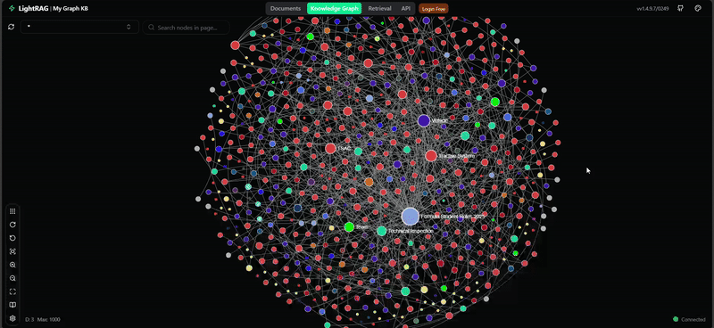

# 🤖 AI Agent for Formula Student Rules (LightRAG + n8n)

> **An intelligent AI agent that understands and answers complex Formula Student Germany (FSG) rules using a graph-based knowledge approach.**

This project demonstrates an **AI-powered rules assistant** capable of answering **complex, relational, and multi-hop questions** about the Formula Student Germany (FSG) rulebook.

It uses:

* 🧠 **[LightRAG](https://github.com/HKUDS/LightRAG)** to build a *graph-structured knowledge base* from the official FSG rulebook PDF.
* 🔄 **[n8n](https://n8n.io/)** to orchestrate the AI agent’s workflow and interaction between the user and LightRAG.

The goal: to deliver **precise, context-aware answers** that go beyond keyword searches by understanding the **relationships** and **dependencies** between rules.

---

## 🌟 Why Graph RAG? (Naive RAG vs. Graph RAG)

For complex, interlinked documents like rulebooks, a traditional "Naive RAG" (chunk-based retrieval) often fails to capture context.
A single rule (e.g., `T14.5.8`) might reference another (`A6.6`) or a safety standard (`T13.1`).
A Naive RAG can’t easily follow these multi-hop relationships.

**Graph RAG** solves this by structuring the rulebook as a *knowledge graph* — enabling the agent to reason about *how* concepts connect.

| Feature             | Naive RAG (Simple Chunks)             | Graph RAG (LightRAG)                                |
| :------------------ | :------------------------------------ | :-------------------------------------------------- |
| **Retrieval**       | Keyword-based text chunk search       | Graph search using entities + relationships         |
| **Context Quality** | Often redundant or noisy              | Clean, structured, and relational                   |
| **Best For**        | Simple factual queries                | Complex, multi-rule reasoning                       |
| **Mechanism**       | `User → Vector Search → Top-K Chunks` | `User → LLM-Guided Graph Search → Entities + Links` |
| **Answer Quality**  | Prone to disjointed synthesis         | Accurate, context-rich, and interpretable           |

> 🧩 *LightRAG understands the structure of the rules — not just their text.*

---

## 🧰 Tech Stack

| Component                | Tool                                          |
| :----------------------- | :-------------------------------------------- |
| **Agent Orchestration**  | [n8n](https://n8n.io/)                        |
| **Graph Knowledge Base** | [LightRAG](https://github.com/HKUDS/LightRAG) |
| **LLM**                  | OpenAI `gpt-4o-mini`                          |
| **Embedding Model**      | OpenAI `text-embedding-3-small`               |
| **Containerization**     | Docker & Docker Compose                       |

---

## 🏗️ Architecture Overview

1. 🗣️ **User Query:** A user submits a question via n8n chat interface.
2. 🤖 **n8n AI Agent:** Acts as the orchestrator, forwarding the query to LightRAG.
3. 🔍 **LightRAG Search:** Performs graph-based retrieval (`only_need_context: true`) to find entities, relationships, and text chunks.
4. 📦 **Structured Context:** Returns only the retrieved context (no LLM generation yet).
5. 💬 **Final Answer:** n8n’s LLM (`gpt-4o-mini`) synthesizes a clear, human-readable answer from the structured context.

> ⚡ *This design minimizes cost and latency by separating retrieval and generation.*

---

## 🚀 Getting Started

### ✅ Prerequisites

You’ll need:

* **Docker Desktop** – to run the LightRAG server.
* **n8n** – self-hosted or cloud.
* **OpenAI API key** – for both embeddings and LLM calls.

### 1️⃣ Set Up LightRAG

```bash
git clone https://github.com/mostafa7arafa/formula-student-graph-rag-bot.git
cd formula-student-graph-rag-bot
cp env.example .env
```

Edit `.env` to add your OpenAI key:

```ini
OPENAI_API_KEY=sk-YOUR_KEY_HERE
LLM_MODEL=gpt-4o-mini
EMBEDDING_MODEL=text-embedding-3-small
```

Then start the server:

```bash
docker compose up -d
```

### 2️⃣ Set Up n8n Workflow

1. Import both:

   * `workflow - Formula Student Rag.json`
2. Update the **HTTP Request node** URL:

   * Local: `http://host.docker.internal:9621/query/data`
   * Remote: use the actual host/IP of the LightRAG container.
3. Save and activate both workflows.

### 3️⃣ Ingest the FSG Rules PDF

1. Go to `http://localhost:9621`
2. Upload the rulebook (e.g., `FS-Rules_2025_v1.1.pdf`)
3. Wait until the ingestion status shows **Completed**

---

## 💡 How to Use

Once both LightRAG and n8n are active:

1. Open the n8n chat interface.
2. Ask questions to **both** Naive and Graph RAG workflows to compare.

**Example queries:**

* “What is the rule for the Tractive System Active Light (TSAL)?”
* “Explain the relationship between the ASMS and the Shutdown Circuit (SDC).”
* “If the RES operator presses the emergency button during autonomous Trackdrive, what happens to the AS-Status lights?”

---

## ⚖️ RAG Comparison Showcase

### 🔍 Example 1 – Relational Question

**Query:** 

> *What is the relationship between the ASMS and the SDC?*

| ✅ Graph RAG (LightRAG)                                                       | ❌ Naive RAG                                      |
| :--------------------------------------------------------------------------- | :----------------------------------------------- |
| Correctly explains the dependency: the SDC can only close if the ASMS is on. | Returns disconnected definitions for both terms. |
| **→ Graph RAG demonstrates relational understanding.**                       | **→ Naive RAG misses the logical link.**         |

---

### 🔎 Example 2 – Complex Multi-Hop Scenario

**Query:**

> *During an autonomous Trackdrive, the perception system fails, triggering a 'Track Lost' state. Before the car stops, the RES operator presses the emergency button. What is the required state of the AS-Status lights?*

| ✅ **Graph RAG (LightRAG)**                                                                                                                                                                                                                                                                                                                                                                                                                                                                                                                                                                                                                                                                                                              | ❌ **Naive RAG (Simple Chunks)**                                                                                                                                                                                                                                                     |
| :-------------------------------------------------------------------------------------------------------------------------------------------------------------------------------------------------------------------------------------------------------------------------------------------------------------------------------------------------------------------------------------------------------------------------------------------------------------------------------------------------------------------------------------------------------------------------------------------------------------------------------------------------------------------------------------------------------------------------------------- | :---------------------------------------------------------------------------------------------------------------------------------------------------------------------------------------------------------------------------------------------------------------------------------- |
| **Response:**<br>In the event of a perception system failure during an autonomous Trackdrive that triggers a *‘Track Lost’* state, pressing the RES emergency button transitions the vehicle into an **‘AS Emergency’** state.<br><br>**Required AS-Status Lights State:**<br>• The **ASSIs (Autonomous System Status Indicators)** must visually reflect the *‘AS Emergency’* state.<br>• An **intermittent sound** must alert personnel to the critical situation.<br>• At least **one ASSI must be visible from any angle**, showing the corresponding illumination of the emergency state.<br><br>These measures ensure full compliance with the safety requirements in the FSG rules.<br><br>**Reference:** FS-Rules_2025_v1.1.pdf | **Response:**<br>The vehicle enters the *“AS Emergency”* state.<br>According to T 14.9.1 and Figure 15, the AS-Status lights must show: **Blue continuous illumination.**<br><br>**Issue:** This is incorrect — “Blue continuous” corresponds to *AS Finished*, not *AS Emergency*. |

> **Analysis:**
> 🧩 *The Graph RAG answer demonstrates reasoning across multiple sections — connecting “Track Lost” → “RES Pressed” → “AS Emergency” → “ASSI + sound requirements”.*
> In contrast, the Naive RAG hallucinates a confident but **incorrect** color indication due to lack of relational understanding.

---

## 📸 Visuals

### 🧩 n8n Workflows


### 🕸️ LightRAG Knowledge Graph



---

## ⚙️ Configuration Tips

* **LightRAG `.env`:**

  * `LLM_MODEL=gpt-4o-mini`
  * `EMBEDDING_MODEL=text-embedding-3-small`
* **Cost Optimization:**
  Using `"only_need_context": true` ensures LightRAG skips the LLM generation step — cutting API costs while maintaining full retrieval accuracy.

---

## 👨‍💻 Author

**Mostafa Arafa**
AI Engineer • Automation Enthusiast • Formula Student Alumni
🔗 [GitHub](https://github.com/mostafa7arafa)

---

## 🏁 License

MIT License © 2025 Mostafa Arafa
